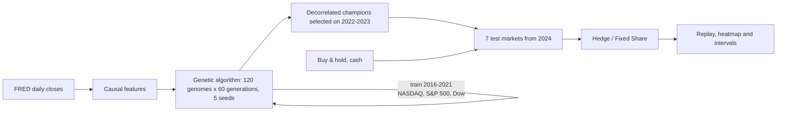

# Online Regret Lab

[](https://github.com/suprkco/Trading-strategies-analysis-regret-minimization/actions/workflows/ci.yml)
[](https://online-regret-lab.onrender.com/)

**A genetic algorithm breeds trading-strategy DNA on US indices; decorrelated champions are frozen and then combined online by Hedge and Fixed Share on seven markets they never saw, across five evolution seeds.**

## Problem

A large strategy search always finds something that looks excellent on past data. Two questions matter: does it survive on unseen markets, and how should you allocate between candidates when you cannot know which one will keep working?

This lab answers both with a declared protocol. It evolves on one set of markets and years, selects on a later window, freezes the champions, then tests on different assets and later dates, five times over. An online learner with a regret guarantee chooses between the champions day by day.

## Demo

**Live:** https://online-regret-lab.onrender.com/ (a free instance can take about a minute to wake up).


The **Genetic evolution · real indices** tab animates each seed's 60 generations: training score against the same genome on validation, and a heatmap of 120 genomes × 36 genes that converges as selection wins. It then shows the frozen champions and the replay on any test market, with the market's price, growth of 100 for every policy and the learners' weights each day. Finally, a **seeds × markets heatmap** compares Hedge with buy & hold, with 95% intervals. Clicking a cell replays it.

The **Regret lab · synthetic regimes** tab runs five rule experts on random regimes, so the winner changes from seed to seed, and compares Hedge with Fixed Share.

Run it locally with `python -m regret_lab.web` and open http://127.0.0.1:8000. The terminal version is `python -m regret_lab.cli`.

## Result

The test markets were declared on 2 October 2026, before any test was computed, and the test was run once. Each market runs from January 2024 to 1 October 2026: about 690 trading days, and 1,005 for Bitcoin, which trades daily. The table shows annualised Sharpe, mean over 5 seeds ± 95% t-interval:

| Test market | Buy & hold | Hedge − buy & hold | Mean champion − buy & hold | Hedge − mean champion |
| --- | ---: | ---: | ---: | ---: |
| Nikkei 225 * | 1.16 | −0.24 ± 0.26 | −1.25 ± 0.50 | **+1.01 ± 0.32** |
| Dow Jones Transportation | 0.45 | **−0.61 ± 0.42** | −0.76 ± 0.28 | +0.15 ± 0.21 |
| Dow Jones Utilities | 0.41 | **−0.61 ± 0.58** | −0.70 ± 0.46 | +0.09 ± 0.22 |
| Brent crude oil | 0.54 | −0.28 ± 0.31 | −0.47 ± 0.22 | **+0.19 ± 0.16** |
| EUR/USD | 0.20 | **−0.79 ± 0.59** | −0.62 ± 0.44 | −0.18 ± 0.21 |
| USD/JPY | 0.46 | **−0.82 ± 0.52** | −0.93 ± 0.40 | +0.12 ± 0.17 |
| Bitcoin | 0.64 | **−0.45 ± 0.19** | −0.79 ± 0.26 | **+0.35 ± 0.09** |

Bold marks an interval that excludes zero. \* The Nikkei 225 was the single test market of an earlier version of this lab, so it is not clean out-of-sample evidence.

- **Evolved strategies do not beat holding the asset.** Only 10 of 119 champion-market pairs beat buy & hold. Hedge is reliably worse than buy & hold on 5 of 7 markets and never reliably better. The test period was a rising market for every asset, which favours buy & hold.
- **Combining online beats picking blindly.** Hedge is reliably better than the average champion on 3 markets and never reliably worse. That is what the regret guarantee promises, and no more.
- **Overfitting is visible in every seed.** The best training genome reaches a score of 1.76-1.98 and drops to −0.20 to +0.15 on validation.

The live page recomputes the test as new FRED closes arrive. The champions stay frozen, so these numbers drift with the window.

## Architecture



## The DNA

Each strategy is 36 genes in [0, 1], decoded in [regret_lab/genetic.py](regret_lab/genetic.py):

- **16 signal weights** over eight indicators, in two sets that switch with the volatility regime ("calm" and "stress"). The indicators are short and long momentum, a moving-average crossover, RSI, Bollinger position, breakout, volatility ratio and drawdown from the 250-day high.
- **7 look-back periods**, each chosen from a discrete menu.
- **10 risk and execution genes:** bias, gain, dead zone, maximum short, stress threshold, volatility target and how much to apply it, exposure smoothing, stop-loss and cooldown.

Exposure is `tanh(gain × (bias + Σ wᵢ·signalᵢ))`, shaped by the risk genes and capped to [−1, 1].

| Component | Rule (fixed before running) |
| --- | --- |
| Score | Sharpe − 2 × \|max drawdown\| of net daily returns, averaged over the three training indices |
| Costs | 2 bp + 10% of 20-day daily volatility per unit of exposure traded; 3% a year on short exposure |
| Selection | Tournament (k=3) on the score minus 0.5 × correlation with the closest of the 5 fittest; elites kept on the raw score |
| Variation | Uniform crossover; Gaussian mutation (rate 0.12, σ 0.15) reflected off the [0, 1] bounds; 4 elites and 4 random immigrants |
| Champions | Greedy: best validation score first, then the best whose weekly validation returns have \|correlation\| < 0.5 with every pick, up to 5 |
| Online learners | Rewards bounded at ±6.3%, the 99.5th percentile daily move in the training data (larger moves clipped and counted); Hedge η from a declared 756-day horizon; Fixed Share for a declared 63-day regime |

The decorrelation rule admits 2 to 5 champions per seed (17 in total). Some of them are weak on validation, which is the price of diversity. Hedge decides at test time how much to trust each one.

## Tech stack

Python 3.10+ standard library only: `http.server` for the web view and `urllib` for data. HTML canvas without a charting library, pytest, Ruff and GitHub Actions. Render hosts the demo. No LLM.

## Quickstart

```sh
python -m regret_lab.web                 # both tabs, http://127.0.0.1:8000
python -m scripts.evolve                 # re-run the five evolutions (~10 min); rewrites evaluation/evolution/
python -m regret_lab.cli --scenario regimes --seed 7
python -m scripts.benchmark              # synthetic benchmark, 5 scenarios x 20 seeds
```

For development, run `python -m pip install -r requirements-dev.txt`, then `python -m pytest -q` and `python -m ruff check .`. The tests run offline. FRED data is downloaded on first use and cached in `.cache/`, which is ignored by Git.

## Evaluation protocol

| Stage | Data | Used for |
| --- | --- | --- |
| Train | NASDAQ Composite, S&P 500, Dow Jones, Oct 2016-Dec 2021 | Fitness during breeding |
| Validation | Same indices, 2022-2023 | Choosing champions |
| Test | Nikkei 225\*, DJ Transportation, DJ Utilities, Brent, EUR/USD, USD/JPY, Bitcoin, from 2024 | Reported once; never loaded by `scripts/evolve.py` |

[evaluation/evolution/](evaluation/evolution) holds every generation's scores and encoded genomes for each seed, the champions with full-precision DNA, the configuration, and SHA-256 digests of the training and validation windows. Index and price data are provider-licensed and not committed. One caveat no protocol removes: the author knew roughly how markets moved in 2024-2026.

### Synthetic regret lab

The synthetic benchmark covers **20 seeds and 500 rounds per scenario**. Fixed Share's α and η are derived only from the horizon and a declared mean regime length of 80 rounds.

| Scenario | Hedge reward | Fixed Share reward | Hedge regret (SD) | Fixed Share regret | Best fixed expert across seeds |
| --- | ---: | ---: | ---: | ---: | --- |
| random regimes | 0.466 | 1.064 | 0.348 (0.068) | −0.250 | momentum 9, reversal 4, long 4, short 3 |
| alternating drift | 1.321 | 1.426 | 0.419 (0.002) | 0.314 | momentum 20 |
| up | 1.601 | 1.664 | 0.410 (0.002) | 0.347 | long 20 |
| down | 1.579 | 1.641 | 0.410 (0.002) | 0.348 | short 20 |
| noise | 0.005 | 0.012 | 0.155 (0.060) | 0.149 | mixed |

Rewards are sums of per-round rewards, not percentages. A negative regret means Fixed Share beat every fixed expert by switching. [Per-seed results](evaluation/results.json).

## Design choices

- **Causal order everywhere.** The exposure held on day t is decided from closes up to t−1. Tests change future prices and check that past positions do not move.
- **Diversity is enforced twice:** during selection, through a correlation penalty, and when choosing champions, through a correlation cap. Five variants of one bet would make the online combination pointless.
- **Experts are frozen policies; the learner is online.** Hedge and Fixed Share share one implementation (`combine` in [core.py](regret_lab/core.py)); α = 0 is Hedge.
- **Declared, not fitted.** The test markets, costs, score, selection rule, reward bound and learner parameters were fixed before the test. Nothing was changed after it.
- **Old code kept for the record.** The original genetic prototype stays in `src/`, unused, with its flaws documented in the [audit](docs/legacy-audit.md). See [method](docs/method.md).

## Limitations

These are index levels and reference rates, not tradable instruments. There are no dividends, no carry on currency positions, and no volume-based market impact: FRED has no volume data, so costs scale with volatility instead. Five seeds give wide intervals. Annualisation uses 252 days for every market, Bitcoin included. Daily technical signals on public data are a weak source of edge; that is consistent with the result and is the point of measuring it honestly. Nothing here is investment advice.

Original portfolio implementation, architected and built by Kilian Codaccioni using generative AI as a productivity multiplier, with a strict focus on evaluation and reproducibility. No employer/client materials. Hedge, Fixed Share and genetic algorithms are credited to the literature and are not claimed as original research. Data courtesy of the Federal Reserve Bank of St. Louis (FRED); index and price copyrights belong to their providers.
