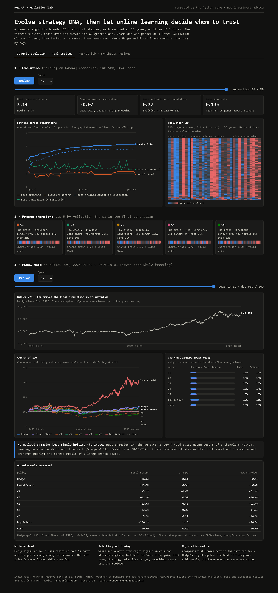
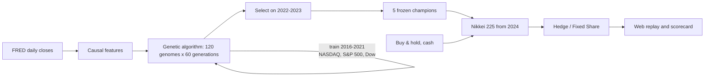

# Online Regret Lab

[](https://github.com/suprkco/Trading-strategies-analysis-regret-minimization/actions/workflows/ci.yml)
[](https://online-regret-lab.onrender.com/)

**A genetic algorithm breeds trading-strategy DNA on real indices; the frozen champions are then combined online by Hedge and Fixed Share on a market they never saw.**

## Problem

A large strategy search always finds something that looks excellent on past data. The questions that matter are whether it survives on unseen data, and how to allocate between candidates when you cannot know in advance which one will keep working.

This lab answers both with an explicit protocol: evolve on one set of markets and years, select on a later window, freeze, then test once on a different market, while an online learner with a regret guarantee chooses between the champions day by day.

## Demo

**Live:** https://online-regret-lab.onrender.com/ (a free instance can take about a minute to wake up).



The page has two tabs:

- **Genetic evolution · real indices.** It animates 60 generations: best and median training Sharpe against the same genomes on validation, and a heatmap of all 120 genomes × 36 genes, where stripes appear as selection converges. Then come the five frozen champions with their DNA, and the final test: the **Nikkei 225** close, growth of 100 for every champion, buy & hold, cash, Hedge and Fixed Share, the learners' weights each day, and a scorecard.
- **Regret lab · synthetic regimes.** Five rule experts on a market whose regime changes at random, so the winner differs from seed to seed. It shows Hedge against Fixed Share, the regime oracle, weights over time and regret against the analytical bound.

Run it locally with `python -m regret_lab.web` and open http://127.0.0.1:8000. The terminal version is `python -m regret_lab.cli`.

## Result

The final test was computed **once**, after the design and the champions were frozen. Nikkei 225, from 4 January 2024 to 1 October 2026 (669 trading days, FRED closes):

| Policy | Total return | Sharpe | Max drawdown |
| --- | ---: | ---: | ---: |
| Buy & hold | +106.1% | 1.16 | −26.3% |
| Hedge over the 7 experts | +16.6% | 0.61 | −20.1% |
| Fixed Share over the 7 experts | +15.9% | 0.59 | −20.0% |
| Best champion (C3) | +12.6% | 0.48 | −21.8% |
| Worst champion (C5) | −5.3% | −0.11 | −26.3% |

**No evolved champion beat holding the index.** The best training genome reached a Sharpe of 2.14 on 2016-2021 US data and −0.07 on 2022-2023: classic overfitting of a 36-dimensional search space. Hedge beat all five champions without knowing in advance which would do well. With rewards normalised by a ±15% daily bound and η set by a three-year horizon, its weights moved little, so it stayed close to a uniform mix that included buy & hold. The page recomputes the test as new closes arrive; the champions stay frozen, so these numbers drift with the window.

## Architecture



## The DNA

Each strategy is 36 genes in [0, 1], decoded in [regret_lab/genetic.py](regret_lab/genetic.py):

- **16 signal weights** over eight indicators, two sets that switch with the volatility regime ("calm" and "stress"). The indicators are short and long momentum, a moving-average crossover, RSI, Bollinger position, breakout, volatility ratio and drawdown from the 250-day high.
- **7 look-back periods**, each chosen from a discrete menu.
- **10 risk and execution genes:** bias, gain, dead zone, maximum short, stress threshold, volatility target and how much to apply it, exposure smoothing, stop-loss and cooldown.

Exposure is `tanh(gain × (bias + Σ wᵢ·signalᵢ))`, then shaped by the risk genes and capped to [−1, 1]. Fitness is the mean annualised Sharpe of net daily returns across the three training indices, after 5 basis points per unit of exposure traded. Evolution uses tournament selection (k=3), uniform crossover, Gaussian mutation (rate 0.12, σ 0.15), 4 elites and 4 random immigrants per generation, with a fixed seed.

## Tech stack

Python 3.10+ standard library only: `http.server` for the web view, `urllib` for data. HTML canvas without a charting library, pytest, Ruff and GitHub Actions. Render hosts the demo. No LLM.

## Quickstart

```sh
python -m regret_lab.web                 # both tabs, http://127.0.0.1:8000
python -m scripts.evolve                 # re-run the evolution (about 90 s); rewrites evaluation/evolution.json
python -m regret_lab.cli --scenario regimes --seed 7
python -m scripts.benchmark              # synthetic benchmark, 5 scenarios x 20 seeds
```

For development, run `python -m pip install -r requirements-dev.txt`, then `python -m pytest -q` and `python -m ruff check .`. The tests run offline. Market data is downloaded from FRED on first use and cached in `.cache/`, which is ignored by Git.

## Evaluation protocol

| Stage | Data | Used for |
| --- | --- | --- |
| Train | NASDAQ Composite, S&P 500, Dow Jones, Oct 2016-Dec 2021 | Fitness during breeding |
| Validation | Same indices, 2022-2023 | Picking the 5 champions from the final generation |
| Test | Nikkei 225, 2024 onward | Reported once; never loaded by `scripts/evolve.py` |

[evolution.json](evaluation/evolution.json) records every generation's scores and genomes, the champions and SHA-256 digests of the training and validation windows. Index data is provider-licensed and is not committed. The design was fixed before the test was run, and nothing was changed after seeing it. One caveat: the author knew roughly how markets moved in 2024-2026, which no protocol can remove.

### Synthetic regret lab

Measured on 1 October 2026 with Python 3.10.4, over **20 seeds and 500 rounds per scenario**. Fixed Share uses α and η derived only from the horizon and a declared mean regime length of 80 rounds (η = 0.837, α = 0.012), with no search.

| Scenario | Hedge reward | Fixed Share reward | Hedge regret (SD) | Fixed Share regret | Best fixed expert across seeds |
| --- | ---: | ---: | ---: | ---: | --- |
| random regimes | 0.466 | 1.064 | 0.348 (0.068) | −0.250 | momentum 9, reversal 4, long 4, short 3 |
| alternating drift | 1.321 | 1.426 | 0.419 (0.002) | 0.314 | momentum 20 |
| up | 1.601 | 1.664 | 0.410 (0.002) | 0.347 | long 20 |
| down | 1.579 | 1.641 | 0.410 (0.002) | 0.348 | short 20 |
| noise | 0.005 | 0.012 | 0.155 (0.060) | 0.149 | mixed |

Rewards are sums of per-round rewards, not percentages. The experts come in symmetric pairs (long/short, momentum/reversal), so the uniform mixture is always exactly zero. A negative Fixed Share regret means it beat every fixed expert by switching. [Per-seed results](evaluation/results.json).

## Design choices

- **Causal order everywhere.** The exposure held on day t is decided from closes up to t−1. Tests change future prices and check that past positions do not move.
- **Selection and test are separated.** Breeding never sees validation or test data; champions are chosen on validation, and the test market is a different index on later dates.
- **Experts are frozen policies; the learner is online.** Hedge and Fixed Share share one implementation (`combine` in [core.py](regret_lab/core.py)) over any full-information reward matrix. α = 0 is Hedge.
- **Parameters are declared, not fitted.** η comes from the horizon, and α from a declared regime length. The test's reward bound and horizon were fixed before the run.
- **Old code kept for the record.** The original genetic prototype stays in `src/`, unused, with its flaws documented in the [audit](docs/legacy-audit.md). This version rebuilds the idea with tests and a held-out protocol. See [method](docs/method.md).

## Limitations and next steps

These are index levels, not tradable instruments. There are no dividends, financing, slippage beyond a flat 5 bp, or intraday execution, and short positions are frictionless. One evolution seed and one test market are anecdotal: the honest next step is many seeds and several held-out markets, with confidence intervals. The ±15% reward bound makes the online learners slow on daily data. A tighter bound or adaptive η should be chosen on validation, never on the test. Nothing here is investment advice.

Original portfolio implementation, architected and built by Kilian Codaccioni using generative AI as a productivity multiplier, with a strict focus on evaluation and reproducibility. No employer/client materials. Hedge, Fixed Share and genetic algorithms are credited to the literature and are not claimed as original research. Index data courtesy of the Federal Reserve Bank of St. Louis (FRED); index copyrights belong to their providers.
