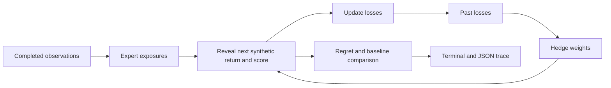

# Online Regret Lab

[](https://github.com/suprkco/Trading-strategies-analysis-regret-minimization/actions/workflows/ci.yml)

**A terminal-first laboratory for online learning with expert advice, explicit external regret and reproducible synthetic experiments.**

## Problem

Choosing a strategy after observing its results is easy; allocating weight before the next outcome is known is harder.
This lab measures how exponential weighting compares with fixed experts and a uniform mixture on bounded synthetic reward sequences.

## Demo

```console
$ python -m regret_lab.cli
regret / switching / seed 42 / 500 rounds
Synthetic rewards. Additive score, not compounded investment return.

POLICY                  CUMULATIVE REWARD
hedge                            1.008355
uniform                          0.005014
cash                             0.000000
long                             0.014423
momentum                         1.384114
contrarian                      -1.378480

Best fixed expert: momentum (hindsight comparator)
External regret:   0.375759
Analytical bound:  0.744659
```

Actual output from the bundled synthetic generator. No browser, API key, external market data or runtime dependency is required. [Interview walkthrough](docs/interview.md).

## Architecture



## Tech stack

Python 3.10+ standard library, pytest, Ruff and GitHub Actions. No LLM: this project demonstrates online learning, experimental design and causal evaluation order.

## Quickstart

From the repository root:

```sh
python -m regret_lab.cli
python -m regret_lab.cli --scenario down --seed 7 --rounds 500
python -m regret_lab.cli --output output/run.json
python -m regret_lab.cli --json
python -m scripts.benchmark
```

For development: `python -m pip install -r requirements-dev.txt`, then `python -m pytest -q` and `python -m ruff check .`. `requirements.txt` intentionally has no runtime packages. The historical `src/` experiment is separate and unsupported.

## Evaluation

Measured locally on 2026-09-30, Python 3.10.4: **20 seeds (0-19), 500 rounds per scenario**, the same analytically chosen learning rate, no parameter search.

| Synthetic scenario | Mean Hedge reward | Mean uniform reward | Mean regret | Sample SD of regret |
| --- | ---: | ---: | ---: | ---: |
| up | 1.764183 | 1.004822 | 0.247167 | 0.012362 |
| down | -0.250230 | -0.993178 | 0.250230 | 0.011012 |
| switching | 0.931172 | 0.004322 | 0.374357 | 0.001026 |
| noise | 0.006450 | 0.005822 | 0.073274 | 0.036096 |

Reward is a **sum of per-round rewards**, not a percentage, wealth curve or annualized return. In the downward scenario, adaptation still loses against cash. These are constructed development scenarios, not held-out financial evidence.

[Complete results](evaluation/results.json) record each seed, input hash, expert totals, learning rate, timestamp and Python version. The 18-test local suite covers hand-calculated updates, probability normalization, bounded inputs, deterministic generation, CLI validation and independence from future outcomes. CI runs Python 3.10 and 3.12.

## Design choices

- **Explicit comparator:** regret equals the best fixed expert's cumulative reward minus the learner's cumulative reward. The hindsight comparator cannot switch experts each round. Regret can be negative on some sequences.
- **Causal order:** choose weights and exposures, reveal the return, score, then update. Momentum uses the previous five completed observations. Contrarian uses the opposite exposure after the first observation; both initially stay in cash.
- **Full information:** all experts' rewards are revealed after each round. This is not a bandit problem. Exposures are 0 or 1; rewards are bounded in [-0.02, 0.02].
- **Numerical stability:** normalize rewards to losses in [0,1], maintain log weights and subtract their maximum before exponentiation. Default eta uses the declared horizon, not future return values.
- **Analytical reference:** the reported bound is `2B * (ln(K)/eta + eta*T/8)`. Tests exercise examples; they do not prove the theorem. See [method](docs/method.md).
- **Traceable evolution:** original code remains in `src/`. Its accounting is not reused; see the [audit](docs/legacy-audit.md).

## Limitations and next steps

The synthetic regimes are simple and public. No real market observations, costs, spread, impact, dividends, financing, compounding or order execution are modeled. No profitability or investment suitability is established. External regret against a fixed expert does not imply small regret against an expert that switches with every regime.

Next: adversarial sequences, switching comparators, horizon sensitivity, and a separate transaction-cost-aware execution model before any market-data evaluation. Real-data work would require versioned licensed data and a predeclared chronological evaluation protocol.

Original portfolio implementation by Kilian Codaccioni, developed with AI assistance. No employer/client materials. The classical algorithm is credited to the literature and is not claimed as original research.
