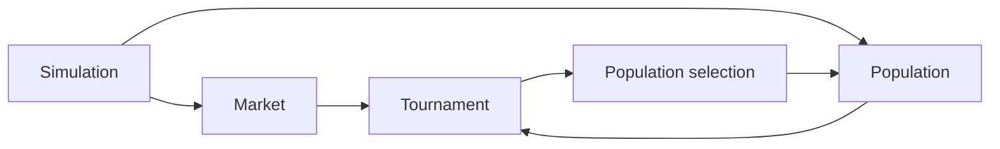

# Historical README (superseded)

# Trading Strategy Simulation

## Problem

This research prototype explores interactions between trading strategies in a simulated market.
It organizes players into a population and runs successive tournaments and selection steps.

## Demo

The entry point is `src/simulation.py`. The default configuration runs 10 generations with 7 rounds and 10 players, pausing for input after each generation. No hosted demo is available.

## Architecture



## Tech stack

Python, NumPy, pandas and yfinance. Dependencies are recorded in `requirements.txt`.

## Quickstart

```sh
python -m venv .venv
# Activate the virtual environment for your shell.
python -m pip install -r requirements.txt
python src/simulation.py
```

The dependency pins date from the original project. Compatibility with current Python versions and the external market-data service has not been validated.

## Evaluation

No reproducible benchmark, return estimate, or regret bound has been established. The repository name is not evidence of a verified regret-minimization algorithm.

## Design choices

Market, player, strategy, population and tournament concerns are separated into Python modules. This makes individual simulation assumptions easier to inspect and replace.

## Limitations and next steps

Document execution and market assumptions; add deterministic seeds and unit tests; validate accounting and selection logic; modernize dependencies; compare against explicit baselines before reporting any financial or algorithmic results.
